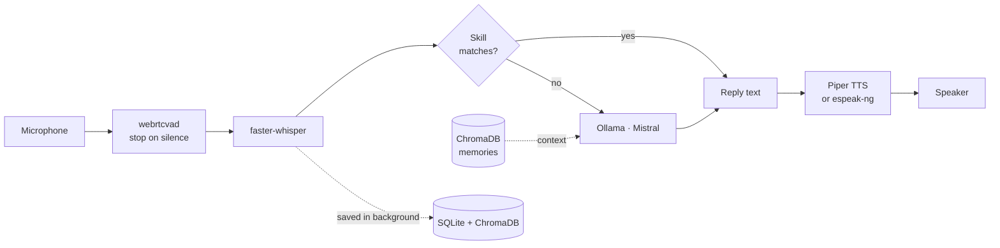

# Flux — Personal Voice Assistant

A Linux voice assistant that runs on your own machine. Say its name, talk to it, and it answers out loud, using a local LLM through [Ollama](https://ollama.com). It saves what you say so it can recall it in later conversations, and it understands English, Hindi and Hinglish.

The repo has two parts:

- **`flux`**, in [`cli/`](cli/): the voice assistant. It has a wake word, a continuous conversation mode, a text mode, and built-in skills for music, volume, weather and maths.
- **The memory backend**, [`main.py`](main.py) and [`backend/`](backend/): a "digital self" that you feed your thoughts to, then question. Its answers come only from what you've told it.

Both keep their data in the same local store, so what you say to `flux` also becomes memory the backend can search.

## Features

- **Wake word.** Say "Flux" (or whatever you name the agent) to start talking.
- **Hands-free conversation.** Voice activity detection stops recording when you stop speaking. Say "stop" or "bye" to go back to waiting for the wake word.
- **Local speech and LLM.** Speech-to-text uses [faster-whisper](https://github.com/SYSTRAN/faster-whisper), replies come from Mistral running in Ollama, and speech output uses [Piper](https://github.com/rhasspy/piper), falling back to `espeak-ng`.
- **Memory.** Everything you say is saved to SQLite and embedded into ChromaDB. When you ask a longer question, relevant past memories are added to the prompt.
- **Skills.** Common commands are answered directly without calling the LLM, which is much faster.
- **Text mode.** You can type instead of speaking, which is useful over SSH or in a noisy room.
- **Languages.** English, Hindi and Hinglish.

## Requirements

- Linux (developed on Ubuntu/Debian)
- Python 3.10+
- [Ollama](https://ollama.com) with the `mistral` model (about 4 GB download; plan for about 4 GB of free RAM)
- A microphone and speakers

## Installation

### 1. System packages

```bash
sudo apt update
sudo apt install portaudio19-dev ffmpeg espeak-ng alsa-utils

# Optional, only needed by the skills that use them:
sudo apt install mpv playerctl brightnessctl
```

### 2. Ollama and the model

```bash
curl -fsSL https://ollama.com/install.sh | sh
ollama pull mistral
```

### 3. Clone and install

```bash
git clone https://github.com/m0nkeyDluffy29/Voice-Assistent.git
cd Voice-Assistent

python3 -m venv .venv
source .venv/bin/activate
pip install -e ./cli
```

This installs the `flux` command along with every Python dependency, including the ones the memory backend needs.

On Debian or Ubuntu, you can instead run `cd cli && ./install.sh`. It installs the system packages and Ollama, pulls Mistral, and installs the package.

The first launch downloads the Whisper speech model and the sentence-embedding model, so it needs an internet connection that one time.

## Usage

> **Run `flux` from the repo root.** That is how it finds the `backend/` memory modules and the bundled `en_US-amy-medium.onnx` voice. If you run it from anywhere else, it still works, but it has no memory and may fall back to `espeak-ng`.

```bash
flux                  # Wake-word mode: say the agent's name to start talking
flux --chat           # Skip the wake word and start a conversation right away
flux --text           # Type instead of speaking
flux --name Jarvis    # Use a different agent name for this session
flux --lang hindi     # english (default) | hindi | hinglish
```

On first launch, `flux` asks you to name the agent and saves the name to `~/.flux_config`.

To end a conversation, say "stop", "exit", "quit", "goodbye", "bye" or "band karo". Press `Ctrl+C` to quit completely.

### Skills

Skills are checked in order before the LLM is called. The first one that matches handles the command.

| Skill | Try saying | Needs |
| --- | --- | --- |
| System control | "volume up", "set volume to 40", "mute", "pause", "next song", "brightness down" | `pactl` or `amixer`, `playerctl`, `brightnessctl` |
| Music | "play Kesariya by Arijit Singh", "stop music" | `mpv`, `yt-dlp`, internet |
| Weather and time | "weather in Mumbai", "what time is it", "what's today's date" | Internet for weather ([Open-Meteo](https://open-meteo.com), no API key) |
| Calculator | "what's 15 percent of 800", "25 times 8 plus 100", "convert 5 km to miles" | `pint` for unit conversion |

To add a skill, create a module in `cli/skills/` that defines `can_handle(query)` and `handle(query, agent_name, language)`, then register it in `SKILLS` in [`cli/skills/__init__.py`](cli/skills/__init__.py).

### Configuration

`~/.flux_config` is a JSON file. Every key is optional:

```json
{
  "agent_name": "Flux",
  "voice": "amy",
  "whisper_size": "base",
  "whisper_beam_size": 1,
  "whisper_best_of": 1
}
```

| Key | Values | Notes |
| --- | --- | --- |
| `voice` | `amy`, `kathleen`, `kristin`, `libritts`, `kusal` | Only `amy` is in the repo. Download other voices (`.onnx` plus `.onnx.json`) from [rhasspy/piper-voices](https://huggingface.co/rhasspy/piper-voices) into `~/piper_voices/` or `models/tts/`. |
| `whisper_size` | `tiny`, `base`, `small`, … | `base` is the default. Smaller models are faster but less accurate. |
| `whisper_beam_size`, `whisper_best_of` | integers | Values above 1 improve accuracy slightly but make transcription noticeably slower. |

## Memory backend (`main.py`)

`main.py` works with your stored memories directly. It has two modes: **feed**, where you save thoughts, and **ask**, where you question them. In ask mode, answers come only from what you've told it. If it has nothing on a topic, it says so.

```bash
python main.py                    # Feed mode: type thoughts to save them
python main.py --voice            # Feed mode with voice input
python main.py --ask              # Ask questions about yourself
python main.py --import notes.txt # Import a text file, one memory per line
python main.py --search "career"  # Semantic search over memories
python main.py --summarise        # Generate this week's summary (--force to redo it)
python main.py --beliefs          # Build or update the belief index
python main.py --sync             # Re-embed all SQLite messages into ChromaDB
python main.py --stats            # Show memory stats
```

In feed mode, type `/help` to see the in-session commands (`/ask`, `/search`, `/recent`, `/beliefs`, …).

## How it works



The backend works like this:

1. **ingest** detects the language, normalises Hinglish, flags opinions and removes duplicates.
2. **memory** stores embeddings (`paraphrase-multilingual-MiniLM-L12-v2`), writes weekly summaries and builds the belief index.
3. **retrieval** ranks memories by relevance and recency.
4. **reasoning** builds the prompt for the local LLM.

For the full design and phase plan, see [`personal-voice-assistant.md`](personal-voice-assistant.md).

## Project structure

```
Voice-Assistent/
├── cli/
│   ├── flux.py                  # Wake word, speech-to-text, LLM, text-to-speech, conversation loop
│   ├── skills/                  # Command handlers that run before the LLM
│   ├── install.sh               # One-shot installer (Debian/Ubuntu)
│   ├── pyproject.toml           # Package config; provides the `flux` command
│   └── requirement.txt
├── backend/
│   ├── ingest/                  # Recording, language detection, preprocessing, SQLite
│   ├── memory/                  # ChromaDB store, weekly summariser, belief index
│   ├── retrieval/               # Semantic retrieval and ranking
│   └── reasoning/               # Ollama answer generation
├── main.py                      # Feed/ask CLI for the memory backend
├── en_US-amy-medium.onnx(.json) # Default Piper voice
├── personal-voice-assistant.md  # Design doc
├── data/                        # Not committed: your SQLite and ChromaDB data
└── models/                      # Not committed: downloaded model cache
```

## Privacy

Speech recognition, the LLM, text-to-speech and memory all run on your machine. Your data stays in `data/`, which is in `.gitignore`. To wipe the assistant's memory, delete that folder.

A few skills do use the network: music streams from YouTube, and weather is fetched from Open-Meteo.

## Known limitations

- If you ask about the weather without naming a city, it uses coordinates hard-coded in [`cli/skills/weather.py`](cli/skills/weather.py). Edit them to set your own location.
- `main.py --ask` replies in text only for now. The spoken-answer module (`backend/output/`) and the desktop UI server (`--serve`, `backend/api/`) are planned but not in the repo yet, so `--ttstest` and `--serve` do nothing useful at the moment.
- Only tested on Linux, because audio playback uses `aplay` and system control uses PulseAudio/ALSA tools.

## Troubleshooting

| Problem | Fix |
| --- | --- |
| `Sorry, I could not reach Ollama` | Start the server with `ollama serve`, and check that `ollama list` shows `mistral`. |
| `No module named sounddevice` or a PortAudio error | Run `sudo apt install portaudio19-dev`, then reinstall with `pip install -e ./cli`. |
| `[piper] voice ... not found` | Run `flux` from the repo root, or copy the `.onnx` and `.onnx.json` files into `~/piper_voices/`. |
| The wake word isn't picked up | Speak close to the mic, choose a short name, or use `flux --chat`. |
| Replies don't use your memories | Run `flux` from the repo root so it can import `backend/`. |

## License

MIT, as declared in [`cli/pyproject.toml`](cli/pyproject.toml).
